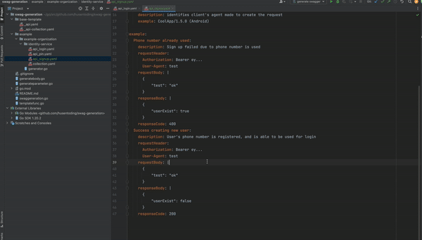

<p align="center"> 
    I have no <b> <i>time </i> </b> nor the <b> <i>will </i> </b> to learn swagger, so i wrote this.
    The aim is to have the least learning curve required to document my API with Swagger.
</p>
<div style="text-align: center;">
    
</div>


### Getting started
- Copy `base-template` folder into your API doc repository
- Create `collection` definition yaml, file name must be `collection.yaml`
- Create `API` definition yaml, format your file name as the following `api_*.yaml`
- Within the repository, create a main go file that generates swagger output
```go
package main

import (
	swaggeneration "github.com/husentoding/swag-generation"
)

func main() {
	builder := swaggeneration.Init("path to base-template", "path to collection.yaml and api_*.yaml")
	builder.Generate("path to the swagger output")
}
```
- Run your main go file

### Files
#### base-template
> base-template provided here is a very basic swagger implementation, feel free to update the base-template to your liking. 
Syntax is written in golang text/template format.

#### collection.yaml
> represent the config for your collections.

> config documentation WIP

#### api_*.yaml
> represent the config for one API.

> config documentation WIP


### Roadmap
- Installation and run through terminal
